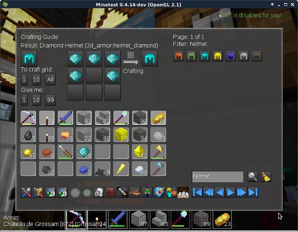
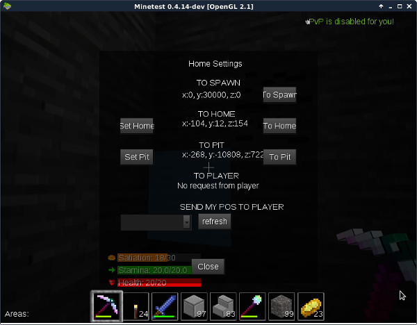
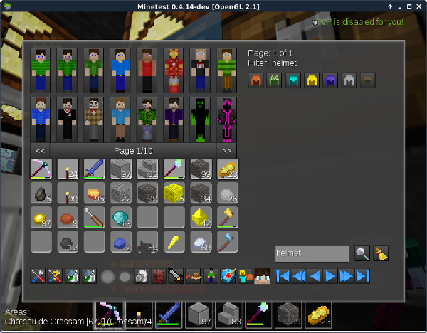
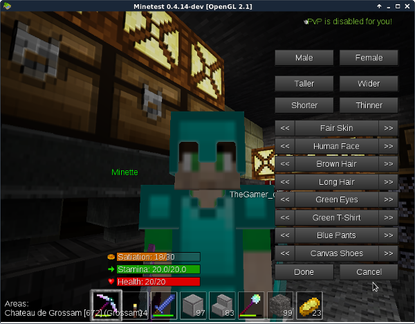
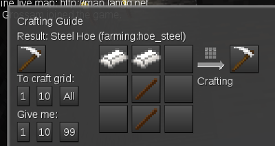
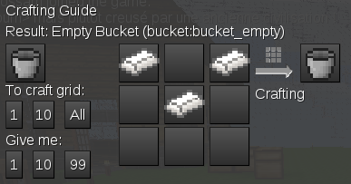
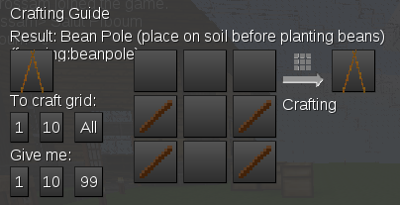
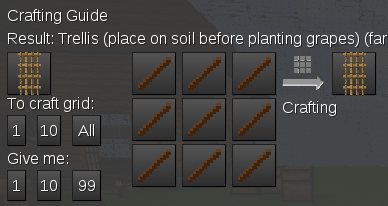
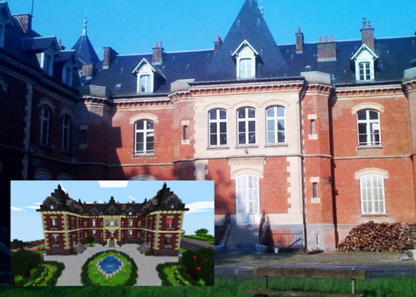

# Premiers pas sur le serveur Mynetest

* [Prenez les commandes](#prenez-les-commandes)
* ["Dis bonjour à la dame !"](#dis-bonjour-à-la-dame-)
* [Premiers pas sur terre](#premiers-pas-sur-terre)
* [Premiers pas à la ferme](#premiers-pas-à-la-ferme)
* [Premiers pas au pied du mur](#premiers-pas-au-pied-du-mur)
* [Premiers pas à la mine](#premier-pas-à-la-mine)
* [Premiers pas avec les commandes](#premiers-pas-avec-les commandes)

## Prenez les commandes

Le serveur Mynetest est accessible depuis plusieurs plateformes (PC, téléphone…) et avec différents programmes clients (Minetest, Worldcraft, Multicraft). Les commandes peuvent être un peu différentes dans chaque cas. Commencez donc par lire attentivement la rubrique d'aide de votre programme pour apprendre à diriger votre personnage, à casser et à poser un bloc, à sauter, à ouvrir votre inventaire…

**L'utilisation de Multicraft est fortement déconseillée : ce client a tendance à faire "planter" les serveurs et votre jeu sera souvent interrompu par les publicités. Le client Minetest, qui est open source, est un meilleur choix.**

Le client Minetest disponible sur les dépôts Linux est configuré pour un clavier anglais (QWERTY) et donc difficile à utiliser sur un clavier français (AZERTY). Heureusement, on peut changer le rôle des touches : à partir du menu d'accueil, cliquez sur l'onglet *Settings*, puis sur le bouton *Change Keys*. Voici un exemple de configuration qui marche bien sur un clavier français :

**Accéder à ce menu est aussi un bon moyen d'apprendre à utiliser les touches sans lire le manuel ;-)**

## Les mystères de l'inventaire

En appuyant sur la touche I, vous ouvrez la fenêtre la plus importante du jeu : l'inventaire. Pour sortir de l'inventaire, vous pouvez appuyer une deuxième fois sur I, ou sur la touche Escape. Regardons-là donc de plus près :

### 1/ L'écran de craft

Il s'agit de votre inventaire lui même et de l'écran de craft. Les neuf cases du haut servent à fabriquer des objets en y faisant glisser des ingrédients selon une disposition bien précise.

Les cases du bas (quatre lignes de dix) représentent les objets que vous portez sur vous. Faites-les glisser pour les disposer comme vous voulez. Seuls les objets de la ligne du haut peuvent être pris en main et utilisés en jeu.

La case *Trash* représente la poubelle : faires-y glisser les objets dont vous voulez vous débarrasser.

### 2/ Le "Crafting Guide"

Dans Mynetest, on peut fabriquer beaucoup d'objets, et il n'est pas possible de se rappeler toutes les recettes. Cette fenêtre est là pour vous aider. Dans la partie de droite, vous voyez tous les objets craftables du jeu. Il y en a plusieurs pages que vous pouvez faire défiler avec les touches 14, celles qui ressemblent aux boutons d'un lecteur DVD.

La petite case suivie d'une loupe sert à rechercher un objet précis. Dans notre exemple, le joueur voulait un casque, il a donc taper "Helmet" avant de cliquer sur la loupe : la fenêtre ne propose plus que les casques. Cliquez sur celui qui vous intéresse, et sa recette s'affiche dans les cases de gauche. Si vous vous rappelez mal le nom d'un objet, vous pouvez juste taper la partie dont vous vous souvenez. Si vous n'êtes pas très à l'aise en anglais, [le lexique](lexique.html "Lexique") est là pour vous aider.

Choisissez ensuite le nombre d'objets que vous voulez fabriquer en cliquant sur les petits boutins sous "To Craft Grid" : un, dix, ou le maximum possible (All). Vous serez automatiquement renvoyé à l'écran de craft où vous trouverez vos ingrédients tout prêts dans la grille du haut. Vous n'avez plus qu'à faire glisser les objets craftés vers la partie inférieure de votre inventaire.

### 3/ Home, Pit, Spawn

Quand vous aurez trouvé le petit coin de nature idéal pour construire votre maison, c'est sur l'icône 3 qu'il faudra cliquer. En utilisant le bouton *Set Home* de la fenêtre qui s'ouvre vous mémoriserez l'endroit comme votre maison et vous pourrez y retourner facilement en cliquant sur *To Home*.

Les boutons *Set Pit* et *To Pit* marchent exactement de la même façon. Ils vous permettent de mémoriser un deuxième endroit qui peut être votre puits de mine, une base secrète, une autre maison… ce que vous voudrez.

*To Spawn* vous ramène au point où vous êtes apparu à votre première connexion. C'est un endroit que tous les joueurs connaissent, c'est donc un bon point de rendez-vous pour se retrouver et faire des échanges.

Les deux dernières lignes servent à [téléporter les joueurs entre eux](faq_minetest.html#comment-téléporter-un-joueur-).

### 4/ Raccourci vers Home

Ce bouton vous permet de retrouver rapidement votre maison sans passer par le menu précédent. On peut aussi taper la commande */home* dans le chat.

### 5/ Jour ! Nuit ! Jour ! Nuit !

Ces icônes permettent de faire lever et coucher le soleil à volonté. Chez la plupart des joueurs elles sont grisées, car il s'agit d'un privilège réservé aux administrateurs.

### 6/ Vider l'inventaire

**ATTENTION !!! Cette icône vide instantanément tout votre inventaire, sans possibilité de récupérer quoi que ce soit !**

### 7/ Sacs

En plus de votre inventaire, vous pouvez porter jusqu'à quatre sacs. Les sacs sont très utiles, car les grands peuvent contenir jusqu'à quarante objets et vous ne perdez pas leur contenu quand vous mourrez. Prenez donc l'habitude d'y placer régulièrement vos trouvailles les plus précieuses.

Quand vous avez fabriqué un sac, faites-le glisser vers l'un des quatre emplacements du haut, puis cliquez sur le sac pour l'ouvrir et accéder à son contenu. Faites ensuite glisser les objets entre votre inventaire (en bas) et le sac.

Les petits sacs se fabriquent avec du coton, les sacs moyens avec des petits sacs et les grands sacs avec des sacs moyens : il vous faudra beaucoup de coton pour arriver à fabriquer quatre grand sacs.

### 8/ PVP On / PVP Off

En cliquant sur cette icône en forme d'épée vous avez la possibilité d'activer ou de désactiver le PVP, c'est à dire la possibilité d'attaquer les autres joueurs, mais aussi d'être attaqué par eux. Il est désactivé par défaut, et il vaut mieux ne pas y toucher quand on débute : un joueur plus expérimenté pourrait vous tuer et vous prendre votre matériel.

### 9/ Concours de pêche

Cliquez sur cette icône en forme de poisson pour voir vos performances lors du dernier concours de pêche auquel vous avez participé.

### 10/ Skin

Cliquez ici pour choisir une nouvelle apparence à votre personnage. C'est un réglage purement esthétique qui ne change rien au jeu.

### 11/ World Edit

Les modérateurs et les administrateurs disposent de puissant pouvoirs qui leur permettent de creuser des lacs ou d'élever des montagnes en quelques clics. C'est ici que ça se passe. Si vous débutez, cette icône est probablement grisée pour vous.

### 12/ Armure

Les cases du bas représentent votre inventaire et les cases du haut l'armure que vous portez. Faires glisser les objets des unes vers les autres pour vous équiper ou vous déséquiper.

### 13/ Character Creator

Ici vous pourrez personnaliser votre personnage en le rendant plus grand, moins gros, en changeant la couleur de ses yeux… Appuyez d'abord deux fois sur la touche F7 pour vous voir "de l'extérieur".

### 14/ Navigation

Nous l'avons déjà vu : ce groupe de boutons permet de naviguer dans la liste des objets craftables.

<!-- ******************* -->

## "Dis bonjour à la dame !"

Quand vous aurez choisi un pseudonyme et un mot de passe, vous serez automatiquement téléporté au "spawn". C'est un grand dôme en verre avec des panneaux placés le long des murs. Sur ces panneaux, en français et en anglais, vous trouverez des conseils, mais aussi les règles du serveur. Prenez le temps de les lire et essayez de bien les comprendre. L'un de ces panneaux donne le code qui permet de quitter le spawn : recopiez ce code dans le chat et vous serez automatiquement téléporté sur la carte.

À ce stade, vous ne pouvez pas encore interragir avec votre environnement mais vous pouvez déjà communiquer avec les autres joueurs (en utilisant la touche T, pour "talk"), alors profitez-en pour dire un petit "bonjour". Le premier passage au "spawn" pose souvent des problèmes aux nouveaux joueurs, n'hésitez donc pas à demander de l'aide. Faites-le poliment et sans oublier les mots magiques ("s'il te plaît" et "merci").

Quand vous demandez de l'aide, faites un effort pour être précis : des messages comme "Help !" ou "Ça marche pas" ne sont pas assez parlants. Essayez de faire simple et précis : "Je suis coincé dans un dôme en verre" , "Je ne trouve pas la sortie du spawn", "Je ne sais pas où taper le code"… Et évitez les messages en majuscules : votre problème n'est pas urgent (Minetest est un jeu, pas un logiciel de contrôle aérien) et vous risquez de vous attirer à tout jamais une réputation de "kikoolol".

**Pour quitter le spawn et accéder au monde du jeu, il faut taper dans le chat un code de trois chiffres et une lettre MAJUSCULE. Ce code est affiché sur un des panneaux qui rappellent les règles du serveur (au bout du couloir en verre).**

<!-- ******************* -->

## Premiers pas sur terre

Maintenant que vous avez votre client bien en main, et que vous avez quitté le spawn, il est temps de partir à l'aventure : la première chose à faire va être de trouver le petit coin de nature idéal pour vous installer, construire votre maison, labourer votre premier champ et ouvrir l'entrée de votre première mine.

Pour cela il vaut mieux s'éloigner du "spawn" (l'endroit ou vous commencez votre partie) car vous aurez du mal à trouver un endroit libre assez grand dans ses parages. Partez donc en exploration jusqu'à ce que vous ayez trouvé le bon endroit : dégagé, pas trop accidenté, avec de l'eau et des arbres à proximité.

Attention ! Ce premier voyage n'est pas sans danger : vous pouvez vous tuer en tombant dans un trou profond ou rencontrer un monstre qui vous fera passer de vie à trépas. Évitez donc de voyager de nuit afin de mieux détecter les pièges du terrain et de pouvoir éviter les monstres avant qu'ils ne vous voient. Si vraiment vous devez voyager de nuit, faites-le en maintenant la touche Maj enfoncée (Sneak) : votre avatar s'arrêtera au bord des trous sans tomber dedans. Ce sera au moins un danger d'évité.

Quand vous mourez, vous perdez votre matériel, qui reste sur place, et vous êtes renvoyé au "spawn". Si vous avez fait un long trajet, il sera presque impossible de retrouver l'endroit où sont tombés vos précieuses possessions. Il y a une astuce pour rendre les choses plus simples en faisant une sorte de sauvegarde : puisque vous n'avez pas encore trouvé l'emplacement définitif de votre "home", utilisez-le pour mémoriser régulièrement la position où vous vous trouvez (si votre "home" est déjà choisi, utilisez votre "pit" !). Du "spawn" vous pourrez vous téléporter directement vers votre dernier "home" provisoire, ce qui vous rapprochera beaucoup de votre équipement.

Petit à petit, votre barre de "satiation" va diminuer : vous commencez à avoir faim ! Quand la barre sera à zéro, vous commencerez à perdre des points de vie. Pensez donc à manger régulièrement et à cueillir les diverses plantes comestibles que vous trouverez durant votre progression. Vous pouvez aussi tuer des animaux pour obtenir de la viande. Une bonne idée est également de couper quelques arbres au passage, à l'aide de votre hache : le bois vous fournira des matériaux de construction et des manches (Sticks) pour fabriquer des outils. Si l'arbre est un pommier il vous fournira en plus de la nourriture.

**Si vous avez perdu tout votre équipement, rappelez-vous qu'on peut abattre les arbres à la main. À partir du bois, vous pourrez refabriquer tous les outils dont vous avez besoin, mais aussi une épée et une armure. Bien sûr, tout cela ne sera as très efficace, mais vous aurez ainsi une chance de pouvoir prendre un nouveau départ.**

<!-- ******************* -->

## Premiers pas à la ferme

Pour se nourrir, cultiver vos propres plantes est plus efficace que de parcourir la carte dans tous les sens pour ramasser des aliments au hasard. Même un petit champ d'une quarantaine de blocs vous mettra largement à l'abri de la famine.

La premier chose à faire pour se lancer dans l'agriculture est de se procurer des semences, c'est à dire des graines que vous pourrez replanter pour en obtenir d'avantage de plantes. La plupart des végétaux que vous pouvez trouver dans la nature peuvent se replanter tels quels (carottes, tomates, patates…). Pour le blé et le coton (pas comestible, mais très utile) il vous faudra des graines. Vous trouverez des graines de blé en coupant de l'herbe (*Grass*) et des graines de coton en coupant de l'herbe de la jungle (*Jungle Grass*).

**Tout près du *Spawn*, il y a un petit champ public où vous pouvez récolter quelques plantes pour vous procurer de la semence. Pensez aux joueurs qui passeront après vous et n'oubliez pas de resemer sur les parcelles que vous venez de récolter. Si vous ne le faites pas, vous risquez d'être banni.**

Ensuite il faudra préparer un terrain adéquat. La plupart des plantes poussent sur de la terre humide et labourée, mais d'autres poussent sur de la terre sèche (non labourée), et les cactus poussent sur le sable sec. Vos plantes pousseront mieux si votre terrain est ensoleillé.

Pour labourer un sol, vous devez utiliser une houe (*Hoe*) qui se craft comme ceci :

Pour que la terre labourée devienne humide, il faut que le bloc de terre soit situé à trois case au maximum d'un bloc d'eau. Pour ça, vous pouvez creuser des canaux d'irrigation et les remplir d'eau, ou créer votre champ par-dessus une étendue d'eau en construisant une sorte de plateforme en terre. Pour transporter de l'eau, il va vous falloir un ou plusieurs seaux :

Ensuite, il faut semer : prenez vos graines en main et faites un clic droit. Les haricots (*Beans*) et le raisin (*Grape*) sont un peu particuliers, car ils ont besoin d'un support pour pousser. Respectivement des *Bean Poles* et des *Trellis* :

"Semez" d'abord le support, puis semez votre plante sur le support. Le cacao utilise un support spécial : le tronc d'un *Jungle Tree*.

**Quand vous abattez un arbre, en plus du bois et des fruits, vous obtenez des *Saplings*. Ce sont des plants à partir desquels vous ferez pousser de nouveaux arbres en les repiquant dans de la terre non labourée. Il est très utile d'avoir du bois près de chez soi : replantez donc les arbres que vous coupez.**

Assez rapidement, vos plantes seront prêtes à être récoltées. Faites-cela par un clic gauche avec n'importe quel outil (attention à la pelle avec laquelle on fait facilement des trous involontaires dans une parcelle bien entretenue !). Vous pourrez utiliser votre récolte de plusieurs façons et la cuire pour créer différentes recettes (donuts, tartes, soupe…). Mais pensez toujours à ne pas tout manger et à garder de quoi semer à nouveau. Quand vous récoltez du cactus ou du papyrus, ne récoltez pas la base : la plante repoussera vite à sa hauteur maximale.

**Le coton ne se mange pas, mais il est très utile, car il sert à fabriquer des sacs qui vous permettront de transporter sur vous jusqu'à 160 objets supplémentaires. Fabriquer quatre grands sacs devrait être l'un de vos premiers objectifs. L'autre avantage des sacs est que vous ne perdez pas les objets qu'ils contiennent lorsque vous mourrez : n'attendez donc pas pour y ranger vos trésors les plus précieux !**

Voici un tableau qui récapitule la façon de cultiver différentes plantes :

| Plante                | Semence       | Support                  | Usage           |
|-----------------------|---------------|--------------------------|-----------------|
| Blé (wheat)           | Wheat seed    | Terre humide             | Nourriture      |
| Cacao                 | Cocoa         | Tronc de Jungle tree     | Nourriture      |
| Cactus                | Cactus        | Sable                    | Briques, armure |
| Café (Coffee)         | Coffe bean    | Terre humide             | Nourriture      |
| Carrot                | Carrot        | Terre humide             | Nourriture      |
| Citrouille (pumpkin)  | Pumpkin slice | Terre humide             | Nourriture      |
| Coton (cotton)        | Cotton seed   | Terre humide             | Sacs, laine     |
| Framboise (Raspberry) | Raspberry     | Terre humide             | Nourriture      |
| Haricot (bean)        | Bean          | Terre humide + Bean Pole | Nourriture      |
| Maïs (corn)           | Corn          | Terre humide             | Nourriture      |
| Myrtille (blueberry)  | Blueberry     | Terre humide             | Nourriture      |
| Papyrus               | Papyrus       | Terre non labourée       | Papier, livres  |
| Patate (potatoe)      | Potatoe       | Terre humide             | Nourriture      |
| Raisin (grape)        | Grape         | Terre humide + Trellis   | Nourriture      |
| Rhubarbe              | Rhubarb       | Terre humide             | Nourriture      |
| Tomate (tomato)       | Tomato        | Terre humide             | Nourriture      |

Matthieu8fr nous offre un [résumé en images](images/champ.jpg "Irrigation") de sa technique d'irrigation.

<!-- ******************* -->

## Premiers pas au pied du mur

### Où trouver l'inspiration

Maintenant que vous avez résolu le problème de la nourriture, vous allez pouvoir commencer à construire votre première maison. Elle vous servira à ranger vos trésors (dans des coffres *verrouillés*), à réparer vos outils et à préparer votre nourriture. Elle donnera aussi une idée de ce que vous savez faire et donnera envie à d'autres joueurs de vous inviter sur leurs projets.

Il vaut mieux avoir une idée de ce qu'on veux faire, même très vague, avant de commencer à construire. Pour vous inspirer, promenez-vous sur le serveur et regardez comment sont faites les maisons des autres joueurs : il y a plein de bonnes idées à piquer. Vous pouvez aussi faire une recherche d'images ou de vidéos sur votre moteur de recherche favori. La réalité peut aussi vous inspirer : regardez autour de vous quand vous ètes en voiture ! Cherchez des photos de monuments existant "IRL"…

Vous pouvez faire le choix d'une construction réaliste, mais aussi partir d'une idée totalement fantaisite, comme un chateau de princesse en laine rose, un vaisseau spatial plein de lumières clignotantes, un sous marin jaune, une maison d'un mètre carré… : se poser des défis entre joueurs peut donner de bonnes idées. Parfois on trouve des usages inattendus pour de vieux objets qui traînent et dont on cherche juste à débarrasser son inventaire (on peut faire un frigo avec deux étagères vides et une porte en verre…).

Voici un build de Matthieu qui s'est inspiré du château de Nouvion-en-Thiérache :

Une maison peut être carrée, rectangulaire ou biscornue. Vous pouvez créer plusieurs sous-sols, des étages, des cours intérieures… La seul limite est votre imagination.

Mais pour un premier essai, il est préférable de s'en tenir à une bonne vieille cabane, en bois ou en pierre.

### Les outils

**La pelle** : c'est l'outil que vous choisirez pour retirer la couche de terre à l'endroit où vous voulez construire votre maison. C'est l'outil le plus rapide pour ce travail. Vous remplacerez cette couche de terre par le plancher du bâtiment. La pelle est également très efficace pour le gravier.

**La pioche** : la pioche peut vous être utile, si vous souhaitez construire votre maison sur des fondations profondes qui pourront vous servir de cave. Cette cave pourra vous servir à ranger tout ce qui n'est pas très beau à voir, ou ce que vous voulez cacher un peu, comme les coffres verrouillés, les fourneaux, les établis… La pioche est l'outil le plus efficace pour creuser la pierre.

**La hache** : c'est l'outil qu'il vous faut pour abattre les arbres et construire en bois. Si vous devez détruire des blocs de bois posés par erreur, la hache fonctionne très bien, et en cas de fausse manœuvre, elle n'attaque pas la pierre alentour. Certains objets, comme les *Wooden Frames* ne peuvent être retirés qu'avec une hache.

**Le fourneau** (*Furnace*) : il vous sert à transformer des matériaux en les faisant "cuire". Il transforme la *Cobble* en pierre et surtout le sable en blocs de verre avec lesquels vous pourrez fabriquer des vitres. Vous pouvez entretenir le feu avec du charbon, de l'herbe, des feuilles ou du bois (Vous pouvez même y brûler des vieux morceaux d'escaliers).

**L'établi** (*Worbench*) : le premier usage de l'établi est [la réparation de vos outils](faq_minetest.html/#comment-réparer-les-outils-). Mais il sert aussi à découper des blocs en morceaux plus petits : il permet de faire des escaliers et des planchettes fines et d'obtenir un résultat moins grossier qu'en se contentant d'utiliser des blocs entiers (une toiture fabriquée avec des marches d'escaliers aura ainsi une pente beaucoup plus régulière). Vous pouvez découper le bois, la pierre, le verre et les métaux, malheureusement pas la laine.

**Le tournevis** (*Screwdriver*) : un petit outil très facile à crafter mais qui rend de grands services. Quand on pose un bloc, il s'oriente automatiquement d'une certaine façon selon l'endroit où l'on se trouve par rapport à l'endroit où l'on pose (c'est une question d'angle et ce n'est pas si simple à maîtriser). Si cette orientation ne vous convient pas, prenez le tournevis en main et cliquez avec sur le bloc pour le faire tourner. Le clic gauche et le clic droit n'ont pas les mêmes effets, et il faut un peu de temps (et d'énervement) pour s'habituer au fonctionnement du tournevis (en réalité, on s'habitue surtout à être énervé…).

### Les matériaux

**Le bois** : c'est le matériaux le plus accessible pour le débutant, et réunir assez de planches pour construire une petite maison est assez rapide. Il existe cinq sortes de bois sur le serveur Mynetest : le pommier, le pin, le tremble (*Aspen Tree*), l'accacia et le bois exotiques. Il sont tous de couleur différentes, ce qui permet de rendre les façades moins monotone. L'accacia est un bois rouge qui donne un très bon résultat pour les toitures.

Le bois peut être utilisé sous forme de planches pour les murs et les cloisons, mais on peut aussi conserver des troncs bruts pour réaliser des charpentes et des éléments de structure (des piliers). Il peut servir pour des portes intérieurs, des escaliers, des fenêtres, des clôtures et toutes sortes de meubles qui permettront de décorer votre intérieur.

**La pierre** : pour obtenir de la pierre, il faut miner, ce qui la rend un peu plus difficile à se procurer que le bois. Mais le serveur Mynetest est un peu plus facile que les autres, car on peu pratiquement crafter tous les types de pierre à partir de la *Cobble* que l'on obtient en quantité en minant de la pierre ordinaire. On peut aussi partir de *Desert Cobble* que l'on obtient en minant de la *Desert Stone* : cette deuxième "famille" de pierres a une couleur rouge très sympa.

Toujours à partir de la *Cobble* on pourra obtenir du sable qui permettra de faire des vitres, mais aussi de la *Sandstone*, une troisième "famille" de pierre, jaune clair, qui est très bien pour faire des intérieurs lumineux. Le gravier (*Gravel*) est assez joli pour réaliser des allées de jardin, et il permet un très bon vieillissement du vin quand on en recouvre le sol d'une cave. Il fait un bruit très rigolo quand on marche dessus.

**Les métaux** :si vous êtes riche, rien ne vous empêche de construire entièrement votre château en or et en mithril, mais les métaux s'utilisent assez peu dans une maisons ordinaire, et au début vous en aurez bien trop besoin pour d'autres usages plus importants. L'utilité principale des lingots de fer est de crafter des portes en fer (*Iron Door*) et des coffres verrouillés (*Locked CHest*) que vous seul pouvez ouvrir. **De manière générale vos portes donnant sur l'extérieur devraient toujours être en fer : pensez aux voleurs !**

**Autres matériaux** : beaucoup d'autres objets peuvent servir à la construction de votre maison. L'obsidienne permet de créer des vitres très transparentes, on peut utiliser du mese pour installer l'électricité, construire une cloison avec des morceaux de cactus, faire une haie avec des feuilles d'arbres, mettre des pots de fleurs un peu partout… N'hésitez pas à détourner certains objets :les blocs de laine au sol font une belle moquette, et on peut faire un canapé confortable à l'aide de cinq ou six coussins. Encore une fois : promenez-vous et piquez les idées des autres. Ils ne se fâcheront pas, au contraire : cela flattera leur ego ;-)

### Quelques astuces techniques

**Commencez par la cave** : un peu comme pour une vraie maison, c'est une bonne idée de commencer par la cave et les fondations. Dans cette cave vous pourrez placer tout ce qui vous sera utile pour le reste de la construction, notamment un fourneau et un *wokbench* dont vous aurez régulièrement besoin. Votre inventaire n'est pas très grand : gardez sur vous uniquement ce qui peut être utile pour l'étape de la construction en cours (la pierre pour les murs, le bois pour la toiture…). Stockez le reste à la cave dans des coffres *verrouillés*.

**Encastrer les fourneaux** : n'hésitez pas à crafter plusieurs fourneaux, car vous gagnerez du temps en faisant chauffer plusieurs éléments à la fois. Pour qu'ils prennent moins de place, vous pouvez les encastrer dans le mur de votre cave. Ce sera plus esthétique et plus réaliste. Vous pouvez laisser le combustible en permanence dans vos fourneaux : si on vous le vole, il ne sera pas trop difficile d'en trouver d'autre.

**Construisez de bas en haut** : construisez votre maison dans un ordre logique : la cave, puis la structure (les angles et les arrêtes), la charpente et la toiture. Finissez par les huisseries (portes et fenêtres) et finalement faites-vous plaisir avec la décoration intérieure. En faisant ainsi votre maison aura une allure réaliste et vous saurez toujours où vous en êtes et ce que vous devez faire pour la suite.

**Construire en hauteur** (les échafaudages) : construire de bas en haut vous permettra aussi de monter sur le sommet des murs à mesure qu'ils s'élèvent et de cosntruire en hauteur. Mais cette technique rencontre une limite quand il faut construire en surplomb, comme le débord d'un toit ou les [mâchicoulis d'un château](https://fr.wikipedia.org/wiki/Mâchicoulis "Mâchicoulis"). Là encore restez réaliste et construisez un échafaudage autour de votre chantier, avec des blocs faciles à retirer par la suite (du verre ou de la terre). Vous y accéderez avec des échelles (*Ladders*), faciles à fabriquer à partir de bois. Ne soyez pas trop pressé d'enlever vos échafaudages : ce serait embêtant de devoir les refaire juste pour une "bricole oubliée".

**Construire en hauteur** (bis) : les joueurs débutant insistent souvent lourdement auprès des modérateurs pour obtenir le privilège "fly" qui permet de voler. Mais on peut parfaitement construire tout un château sans lui. Il existe une astuce pour prendre rapidement de la hauteur : prenez des blocs d'un matériau quelconque, regardez vos pieds (vers le bas), sautez, et *pendant que vous êtes en l'air* posez un bloc à l'endroit où vous allez retomber : vous voilà un cran plus haut ! Au début, il faut un peu de temps pour trouver le bon rythme, mais quand on a l'habitude, il est possible de répéter rapidement la manipulation et d'obtenir un genre d'ascenseur express : sauter, poser, sauter, poser… Mais gare à la chute ! Pour redescendre progressivement, il faut détruire un par un les blocs sous vos pieds, en essayant de ne pas vous mettre un coup de pioche sur les orteils :-)

**L'éclairage "ordinaire"** : la façon la plus simple d'éclairer une maison est de placer des torches par-ci par-là le long des murs. Vous pouvez aussi détourner des clôtures (*Fence*) pour créer un genre de lustre au plafond. Le torches sont faciles à transformer en bougies, ou en lanternes. Pour ces dernières il vous faudra des pépites de fer (*Iron Lump*) pensez donc à ne pas toutes les transformer en lingots dès votre retour de la mine (cette transformation est irréversible). Vous pouvez obtenir une maison plus lumineuse, le jour, en prévoyant de grandes fenêtres et, le reste du temps, en utilisant surtout des matériaux clairs pour les murs et les planchers : *Aspen Tree Plank* et *Sandstone Brick* sont idéals pour cela.

**L'éclairage par Mesecon** : un système Mesecon permet de créer toutes sortes d'éclairages, colorés, clignotants, avec un interrupteur… et même un éclairage solaire qui s'allume automatiquement à la tombée de la nuit. Il faudrait plusieurs pages de tutoriel pour expliquer tout ça. Quand on débute, ce qu'il faut garder en tête c'est que toutes ces lampes sont alimentées en énergie par un genre de circuit électrique composé de *Mesecon* (des sortes de fils électriques). Pour que le résultat soit esthétique, il faudra cacher ce circuit, comme dans la réalité, derrière une double cloison ou un faux plafond. Si vous prévoyez d'installer plus tard un système Mesecon, pensez donc à créer cet habillage dès la conception de vos pièces, car si vous le faites après coup, vous risquez de beaucoup réduire votre espace vital, avec des cloisons qui feront trois blocs d'épaisseur.

**Construire en rond** : construire en rond est plutôt à déconseiller aux débutants, car c'est assez difficile (surtout pour de petits cercles). Rappelez-vous qu'à une certaine époque les châteaux avaient tous des tours carrées plus faciles à construire (c'est l'invention de l'artillerie qui a déclenché l'apparition des tours rondes : les boulets "glissaient" plus facilement sur leur surface galbée et faisaient donc moins de dégâts). Si vous tenez absolument à construire des tours rondes, vous trouverez facilement des "patrons" en faisant une recherche sur internet. [Celui-ci](http://www.wtcraft.com/plans-de-cercles-1108.html "Cercles") par exemple… Si vous travaillez sur un projet public, vous pouvez aussi demander l'aide d'un modo : il dispose d'outils qui lui permettront de vous faire ça en deux coups de cuiller à pot !

### Dix erreurs à ne pas commettre

<!-- TODO : des suggestions d'erreurs ? -->

1. **Construire trop petit** :

2. **Utiliser un seul matériau** :

3. **Construire un toit plat** :

4. **Construire un toit sans débord** :

4. **Construire sur un terrain trop petit** :

5. **Ne pas faire évoluer** :

### Un "Build" pas à pas

<!-- ******************* -->

## Premiers pas à la mine

## Premiers pas avec les commandes

Vous retrouverez dans cette section la plupart des actions decrites plus haut. Mais avec les *commandes* vous aller gagner du temps ! Une commande est un message adressé au serveur. Il se tape dans le chat et commence toujours pas le caractère */* (pour montrer que c'est un message "spécial"). 

Le première avantagfe des commandes est la rapidité : il est, par exemple plus rapide de taper */sethome* que de parcourir plusieurs menus pour mémoriser votre "home". L'autre avantage est qu'elle sont universelle : elles fonctionne quel que soit le [client](#client--serveur--on-nest-pas-au-bistrot-) que vous utilisez.

Voici donc quelques commandes parmi les plus utilisées (les mots entre guillemets "…" sont des *paramètres* : ils doivent être remplacés par ceux qui correspondent à votre désir).

### Commandes utilitaires ###

Ces commandes permettent d'échanger des information avec le serveur :

* **/help "nom_de_la_commande"** : si vous avez oublié comment on utilise une commande, utilisez */help* avec le nom de la commande en paramètre ; un court message vous rappellera à quoi elle sert et les paramètres qu'elle utilise. */help all* affiche la liste de toutes les commandes disponibles.
* **/home et /pit** : pour enregistrer la position de votre home il suffit de taper dans le chat: */sethome*. Pour le pit c'est assez semblable : taper: */setpit*. Il suffit ensuite de taper */home* ou */pit* pour vous vous rendre à l'endroit que vous souhaitez.
* **/pulverize** fait disparaître l'objet que vous tenez à la main ; c'est plus rapide que la poubelle pour se débarrasser d'un stack de "cobble".
* **/time** : vous retourne l'heure qu'il est dans le jeu. Un bon moyen de savoir si le soleil va bientôt se lever.
* **/mapfix** : parfois l'affichage pésente de petits bugs de lumière ou de courant de l'eau. Cette commande permet de les corriger.
* **/status** : affiche le message d'accueil du serveur et la liste des joueurs connectés.
* **/irc_names** : affiche la liste des personnes connectées par le canal IRC (un protocole de messagerie instantanée). Mynetest et ChanServ ne sont pas des personnes réelles.
* **/mods** : affiche la liste des mods instalés sur le serveur.
* **/last-login "pseudo_du_joueur"** : vous indique l'heure et la date de la derniére connexion d'un joueur (attention ! dans cette commande les mots sont séparés par le tiret du 6 au lieu de l'"underscore", tiret du 8).
* **/privs "pseudo_du_joueur"** : donne la liste des provilèges accordés à un joueur. Si vous ne précisez pas de pseudo, votre propres privilèges seront affichés. Tous les joueurs commencent avec interact,shoot,home et zoom.

### Communiquer ###
* **/msg "pseudo_du_joueur"** : permet d'envoyer un message privé à un joueur qui est en ligne ; il sera le seul à pouvoir le lire.
* **/mail "pseudo_du_joueur"** : permet d'envoyer un message privé à un joueur qui n'est pas en ligne. Quand vous vouv connectez, vous pouvez faire */inbox* pour lire les message arrivés pendant votre absence.
* **/me "votre_message"** : sert à afficher un message qui décrit vote humeur ou votre activité du moment. Exemple /me Je mine !
* **/invite_player "pseudo_du_joueur"** : invite un joueur à se téléporter sur vous : pour teleporter toto, tapez */invite_player toto*. Il ne reste plus à toto qu'à accepter l'invitation à l'aide de la commande */to_player* (cette commande téléporte un joueur à la dernière personne qui l'a invité.
* **/bb "code_de_la_langue"** : cette commande vous permet de traduire vos messages vers une autre langue. Pour trasuire un message en anglais, par exemple, faites */bb EN Salut Toto !*. Dans le chat, Toto pourra lire "Hello Toto !". Pour connaître la liste des langues disponible, tapez */bbcodes*.
* **/bblangs "code_de_la_langue"** : cette fois il s'agit de traduire les message des autres joueurs. Si par exemple Toto vous répond "I need help", tapez */bblang FR* puis */babel toto* : la traduction du dernier message de Toto, apparaîtra ("J'ai besoin d'aide."). Il n'est pas nécessaire de taper à chaque fois la commande */bblangs* : elle définit une fois pour toutes votre préférence en matière de langue (mais cette préférence est éffacée en cas de redémarrage du serveur).

### Les tournois ###
Le mod PVPplus permet de faire des tournois PVP, c'est-à-dire des combats entre joueurs. Il s'utilise uniquement avec des commandes.Voici les principales :

* **/tournament** : lance un tournois simple.
* **/tournament teleport** : lance un tournois. Les joueurs qui s'engagent seront automatiquement téléportés à votre position.
* **/tournament teleport "nombre_de_secondes"** : la,ce un tournois en retardant son début du nombre de secondes indiqué (par defaut c'est 60 secondes).
* **/engage** : rejoindre un tournois
* **/leave_tournament** : quitter un tournois.

